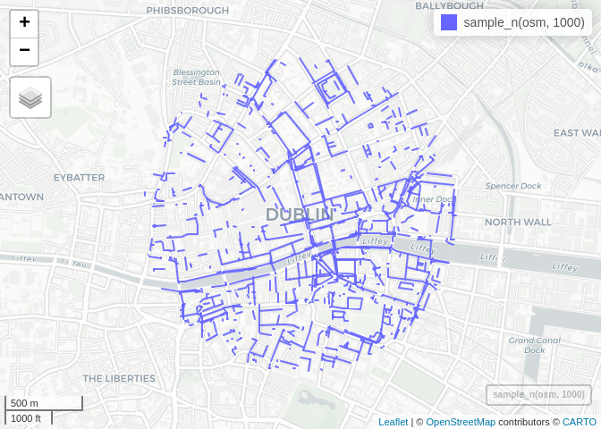
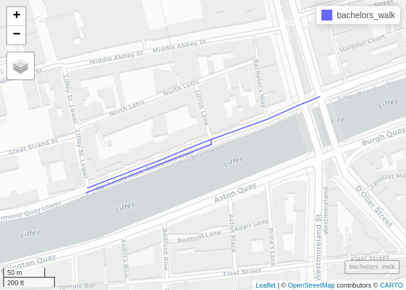
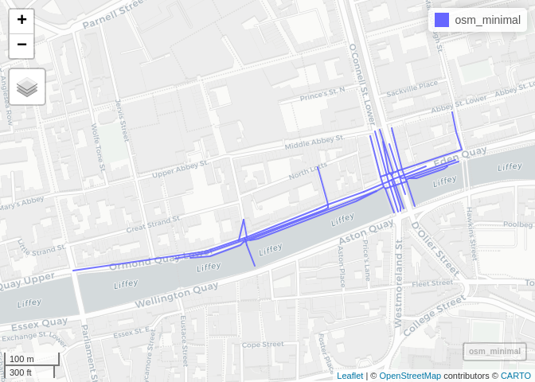
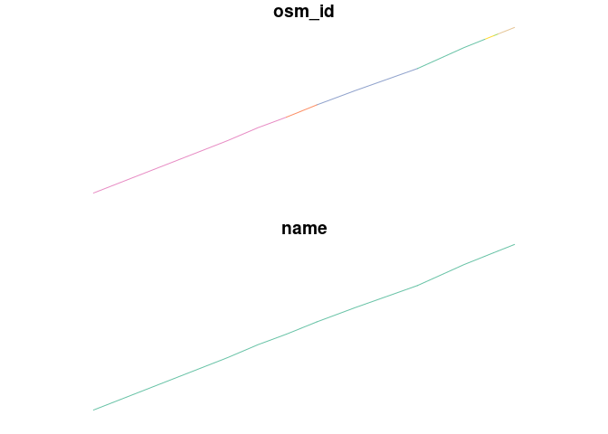
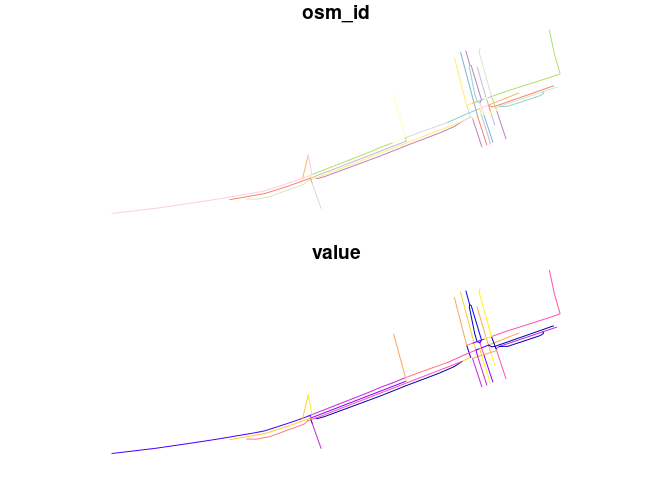

``` r
remotes::install_github("nptscot/osmactive")
```

    Using github PAT from envvar GITHUB_PAT

    Skipping install of 'osmactive' from a github remote, the SHA1 (0449182d) has not changed since last install.
      Use `force = TRUE` to force installation

``` r
library(tidyverse)
```

    ── Attaching core tidyverse packages ──────────────────────── tidyverse 2.0.0 ──
    ✔ dplyr     1.1.4          ✔ readr     2.1.5     
    ✔ forcats   1.0.0          ✔ stringr   1.5.1     
    ✔ ggplot2   3.5.0.9000     ✔ tibble    3.2.1     
    ✔ lubridate 1.9.3          ✔ tidyr     1.3.1     
    ✔ purrr     1.0.2          

    ── Conflicts ────────────────────────────────────────── tidyverse_conflicts() ──
    ✖ dplyr::filter() masks stats::filter()
    ✖ dplyr::lag()    masks stats::lag()
    ℹ Use the conflicted package (<http://conflicted.r-lib.org/>) to force all conflicts to become errors

``` r
library(sf)
```

    Linking to GEOS 3.12.1, GDAL 3.8.4, PROJ 9.3.1; sf_use_s2() is TRUE

``` r
dublin_zones = zonebuilder::zb_zone("Dublin")
```

    Loading required namespace: tmaptools

``` r
osm = osmactive::get_travel_network("Republic of Ireland", boundary = dublin_zones, boundary_type = "clipsrc")
```

    No exact match found for place = Republic of Ireland and provider = geofabrik. Best match is Britain and Ireland. 
    Checking the other providers.
    No exact match found in any OSM provider data. Searching for the location online.
    The input place was matched with Ireland and Northern Ireland. 
    The chosen file was already detected in the download directory. Skip downloading.

    Warning: The boundary is composed by more than one features. Selecting the
    first.

    Starting with the vectortranslate operations on the input file!

    0...10...20...30...40...50...60...

    Warning in CPL_gdalvectortranslate(source, destination, options, oo, doo, :
    GDAL Message 1: A geometry of type MULTILINESTRING is inserted into layer lines
    of geometry type LINESTRING, which is not normally allowed by the GeoPackage
    specification, but the driver will however do it. To create a conformant
    GeoPackage, if using ogr2ogr, the -nlt option can be used to override the layer
    geometry type. This warning will no longer be emitted for this combination of
    layer and feature geometry type.

    70...80...90...100 - done.

    Finished the vectortranslate operations on the input file!

    Reading layer `lines' from data source 
      `/home/robin/data/osm/geofabrik_ireland-and-northern-ireland-latest.gpkg' 
      using driver `GPKG'
    Simple feature collection with 3723 features and 31 fields
    Geometry type: MULTILINESTRING
    Dimension:     XY
    Bounding box:  xmin: -6.275573 ymin: 53.3404 xmax: -6.245544 ymax: 53.35836
    Geodetic CRS:  WGS 84

``` r
osm |>
  sample_n(1000) |>
  mapview::mapview()
```



``` r
bachelors_walk = osm |>
  filter(name == "Bachelors Walk") 
nrow(bachelors_walk)
```

    [1] 9

``` r
mapview::mapview(bachelors_walk)
```



``` r
bachelors_walk_buffer = bachelors_walk |>
  sf::st_buffer(20)
osm_minimal = osm[bachelors_walk_buffer, , op = sf::st_intersects]
mapview::mapview(osm_minimal)
```



We’ll create some dummy data in a subset of the data:

``` r
net_x = bachelors_walk |>
  filter(highway != "cycleway") |>
  select(osm_id, name)
plot(net_x)
```



``` r
net_y = osm_minimal |>
  transmute(
    osm_id = osm_id,
    value = round(runif(nrow(osm_minimal), 0, 100))
  )
plot(net_y)
```



``` r
sf::write_sf(net_x, "net_x.geojson", delete_dsn = TRUE)
sf::write_sf(net_y, "net_y.geojson", delete_dsn = TRUE)
```
